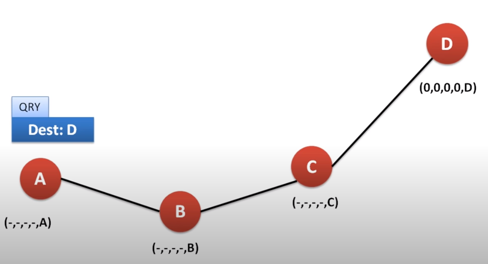
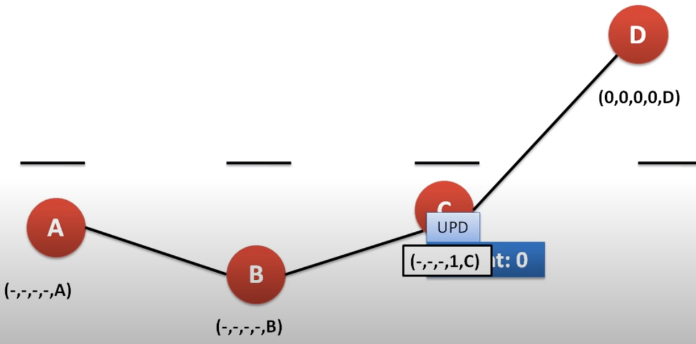
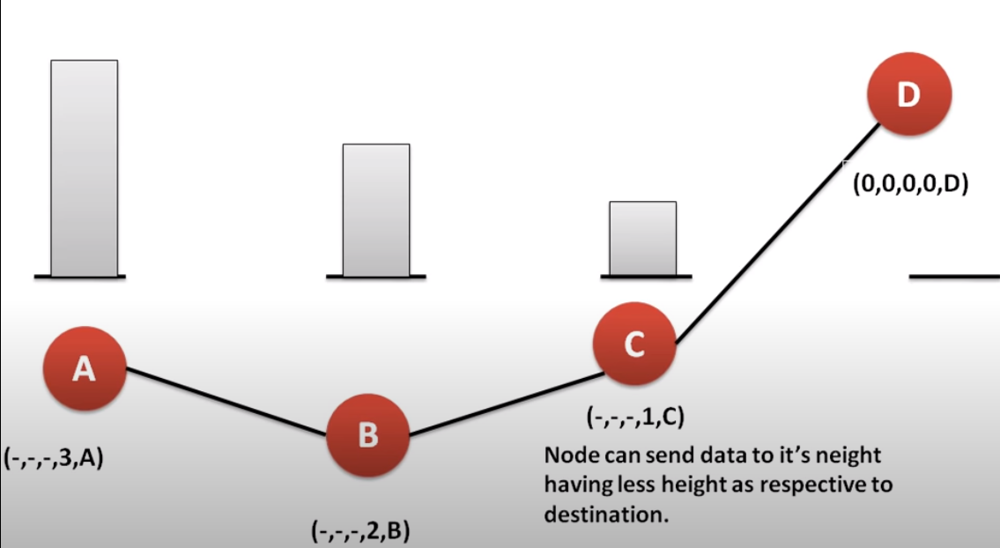

.. include:: substitutions.rst

.. role:: raw-latex(raw)
    :format: latex

|TORA|
=========================================

Background and Related Work
~~~~~~~~~~~~~~~~~~~~~~~~~~~~~~

Temporally-Ordered Routing Algorithm was originally proposed in [CITATION] by Vincent D. Park and M. Scott Corson. TORA is a distributed algorithm designed for mobile ad hoc networks to establish and maintain efficient routes in dynamic network environments. The algorithm is based on the concept of link reversal, where nodes maintain a logical link reversal hierarchy to facilitate routing decisions in response to topological changes.

Distributed Algorithm: |TORA|
~~~~~~~~~~~~~~~~~~~~~~~~~~~~~~~~~~~~~~~~~~~~~~~~~~~~~~~~~~~~~~~~~~~~~~~~~~~~~~~~~~~~~~~~~~~~~~~~~~~~~~~

In the Temporally-Ordered Routing Algorithm (TORA), control packets play a crucial role in facilitating efficient routing in mobile wireless networks. TORA utilizes three main types of control packets: Query (QRY), Clear (CLR), and Update (UPD). When a node needs to establish or update a route to a destination, it broadcasts a Query (QRY) packet to its neighbors. Upon receiving a QRY packet, neighboring nodes determine their relative positions in the network and create a directed acyclic graph (DAG) based on this information. The DAG helps in establishing a logical link reversal hierarchy for routing decisions.

The handling of control packets in TORA is based on the concept of link reversal. When a link failure occurs, the affected node broadcasts a Clear (CLR) packet to inform its neighbors about the failure. Neighboring nodes then propagate the CLR packet, triggering a process of link reversal to re-establish routes around the failed link. Additionally, Update (UPD) packets are used to disseminate information about changes in the network topology, ensuring that all nodes have up-to-date routing information.

In TORA, the creation of a route involves the establishment of a directed acyclic graph (DAG) based on the relative positions of nodes in the network. This DAG helps in determining the logical link reversal hierarchy, which guides the routing decisions in response to topological changes. The algorithm ensures loop-free routes by utilizing the DAG structure and maintaining multiple routes for any given source/destination pair, enhancing the robustness of the routing process.

TORA defines five cases for route maintenance to handle various scenarios in dynamic network environments:

- Case 1 (Generate):
This case occurs when a node loses its last downstream link to the destination.
The node generates a new reference level and broadcasts it to its neighbors.
By creating a new reference level, the node initiates the process of establishing a new route to the destination.
:raw-latex:`$$(\tau_{i}, oid_{i}, r_{i}) = (t, i, 0), \text{where } t \text{ is the time of failure.}$$`

:raw-latex:`$$(\delta_{i}, oid_{i}, r_{i}) = (0, i)$$`

- Case 2 (Propagate):
In this case, a node has no downstream links due to a link reversal following the reception of an Update (UPD) packet.
If the ordered sets of :raw-latex:`$(\tau, oid, r)$` are not equal for all neighbors, the node propagates the reference level of its highest neighbor.
The node selects a height that is lower than all neighbors with that reference level, ensuring the establishment of a new route based on the propagated information.

- Case 3 (Reflect):
When a node has no downstream links due to a link reversal following the reception of an UPD packet and the ordered sets of :raw-latex:`$(\tau, oid, r)$` are equal for all neighbors, with r = 0.
In this scenario, the node reflects back a higher sub-level, maintaining the consistency of the reference levels among neighbors.
:raw-latex:`$$(\tau_{i}, oid_{i}, r_{i}) = (t_{j}, oid_{j}, 1)$$`

:raw-latex:`$$(\delta_{i}, i) = (0, i)$$`

- Case 4 (Detect):
This case is triggered when a partition in the network is detected, indicating a significant topological change.
Node i sets its height and the height entry for each neighbor to NULL, except when the destination is a neighbor, in which case the corresponding height entry is set to ZERO.
All entries in the link-state array are updated, and a Clear (CLR) packet is broadcast to erase invalid routes and initiate the route re-establishment process.
:raw-latex:`$$(\tau_{i}, oid_{i}, r_{i}) = (NULL, NULL, NULL)$$`

:raw-latex:`$$(\delta_{i}, i) = (NULL, i)$$`

- Case 5 (Generate):
Similar to Case 1, this case involves generating a new reference level when a node loses its last downstream link to the destination.
The node creates a new reference level and broadcasts it to neighbors, initiating the process of establishing a new route to the destination.
This action ensures that the routing hierarchy is maintained and that routes are efficiently re-established in response to topological changes.
:raw-latex:`$$(\tau_{i}, oid_{i}, r_{i}) = (t, i, 0)\text{, where } t \text{ is the failure time}$$`

:raw-latex:`$$(\delta_{i}, i) = (0, i)$$`

.. _BlindFloodingAlgorithmLabel:

.. code-block:: RST
    :linenos:
    :caption: Temporally-Ordered Routing Algorithm
    

    Events: OnMessageFromBottom

    OnMessageFromBottom(m):
        If m.type == QRY:
            Handle_QRY(m);
        Else if m.type == CLR:
            Handle_CLR(m);
        Else if m.type == UPD:
            Handle_UPD(m);

    Handle_QRY(m):
        If no downstream links and route not required:
            Broadcast(QRY, destination);
        Else if height.delta is NULL:
            minHeight = findMinHeight();
            setHeight(minHeight + 1);
            linkReverse = false;
            broadcast(UPD, minHeight, destination, linkReverse);
    
    Handle_CLR(m):
        If m.referenceLevel == height.referenceLevel:
            setHeightToNull();
        for each neighbor that is not destination:
            setHeightToNull(neighbor);
        If m.reference_level == height.referenceLevel:
            broadcast (CLR, destination, m.referenceLevel);

    Handle_UPD(m):
        If m.linkReverse == true and no downstream link:
            for each upstream neighbor:
                UpdateReferenceLevel();
            
            If not same reference level:
                Case2();
            Else if m.referenceLevel(oid) == 0:
                Case3();
            Else if m.referenceLevel(i) == node id:
                Case4();
            Else:
                Case5();
        Else:
            If route not required:
                Case1();
            Else:
                UpdateHeight();
                linkReverse = false;
                Broadcast(UPD, height, destination, linkReverse);
            

Example
~~~~~~~~

Imagine the scanrio in the figure below where nodes A, B, C, and D are connected in a network. Node A wants to send a message to node D. In the start all nodes have a null height except for the destination which has a height of zero. Node A sends a Query (QRY) packet to its neighbor B to establish a route to node D. B then broadcasts the message to its neighbor C and so on until it reaches the destination D.

In this case, D will send back an Update (UPD) packet to its neighbors to establish the route. C will receive the UPD packet and will update its height along with incrementing the height in the UPD message. When B receives the UPD packet, it will update its height and broadcast the message to A. Finally, A will receive the UPD packet and update its height.

As you can see from the figure, now we can establish a route from A to D to form a DAG. This is because there are now downstream links from A to B to C to D.

This demonstrates a basic example of how TORA works to establish a route in a mobile ad hoc network. Of course in a more complex network, more maintainence cases are needed to handle various scenarios.

Correctness
~~~~~~~~~~~

The correctness of TORA is ensured by its ability to establish loop-free routes, react to topological changes within a finite time, and maintain stable routing in dynamic network environments. Safety is guaranteed by the avoidance of routing loops, while liveness is achieved through timely reactions to link failures and recoveries. Fairness is maintained by treating all nodes equally in updating their routes based on received control packets.

Complexity 
~~~~~~~~~~

1. Time Complexity: The Temporally-Ordered Routing Algorithm takes at most O(2D) time units to complete where D is the diameter of the network (maximum number of nodes in the longest path).
2. Space Complexity: The space complexity is O(D_d*A) where D_d is the number of maximum desired destinations and A is the average number of adjacent nodes.

.. [Fokking2013] Wan Fokkink, Distributed Algorithms An Intuitive Approach, The MIT Press Cambridge, Massachusetts London, England, 2013
.. [Tel2001] Gerard Tel, Introduction to Distributed Algorithms, CAMBRIDGE UNIVERSITY PRESS, 2001
.. [Lamport1985] Leslie Lamport, K. Mani Chandy: Distributed Snapshots: Determining Global States of a Distributed System. In: ACM Transactions on Computer Systems 3. Nr. 1, Februar 1985.