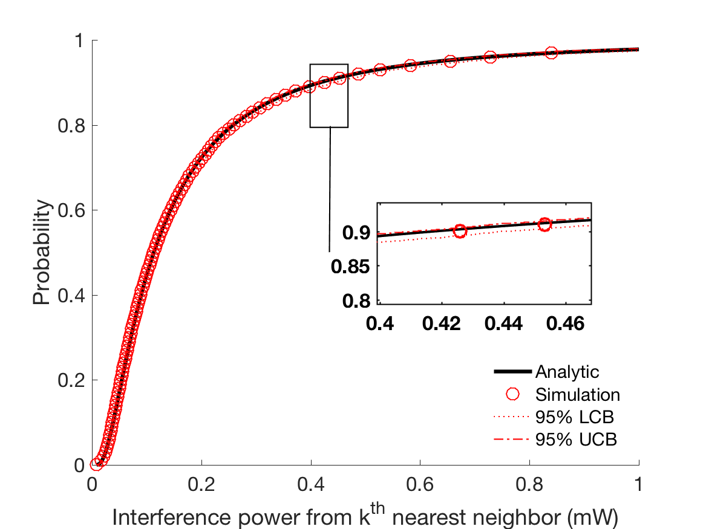

.. include:: substitutions.rst

Implementation, Results and Discussion
======================================

Implementation and Methodology
~~~~~~~~~~~~~~~~~~~~~~~~~~~~~~~~~~~~

We have implemented the Temporally-Ordered Routing Algorithm in Python as is available as an open-source repository on Github. The implementation is based on the algorithm described in the paper in section 1.3 and follows the structure of AHCv2 and utilizes its components (e.g. channels, generic messages, etc.). For the evaluation phase, this algorithm is tested with different topologies and different message sizes. The results along with the discussion are presented in the next section. 

Results
~~~~~~~~

Present your AHCv2 run results, plot figures.

This is probably the most variable part of any research paper, and depends upon the results and aims of the experiment. For quantitative research, it is a presentation of the numerical results and data, whereas for qualitative research it should be a broader discussion of trends, without going into too much detail. For research generating a lot of results, then it is better to include tables or graphs of the analyzed data and leave the raw data in the appendix, so that a researcher can follow up and check your calculations. A commentary is essential to linking the results together, rather than displaying isolated and unconnected charts, figures and findings. It can be quite difficulty to find a good balance between the results and the discussion section, because some findings, especially in a quantitative or descriptive experiment, will fall into a grey area. As long as you not repeat yourself to often, then there should be no major problem. It is best to try to find a middle course, where you give a general overview of the data and then expand upon it in the discussion - you should try to keep your own opinions and interpretations out of the results section, saving that for the discussion [Shuttleworth2016]_.

.. list-table:: Title
   :widths: 25 25 50
   :header-rows: 1

   * - Heading row 1, column 1
     - Heading row 1, column 2
     - Heading row 1, column 3
   * - Row 1, column 1
     -
     - Row 1, column 3
   * - Row 2, column 1
     - Row 2, column 2
     - Row 2, column 3

Discussion
~~~~~~~~~~

Present and discuss main learning points.

.. [Shuttleworth2016] M. Shuttleworth. (2016) Writing methodology. `Online <https://explorable.com/writing-methodology>`_.