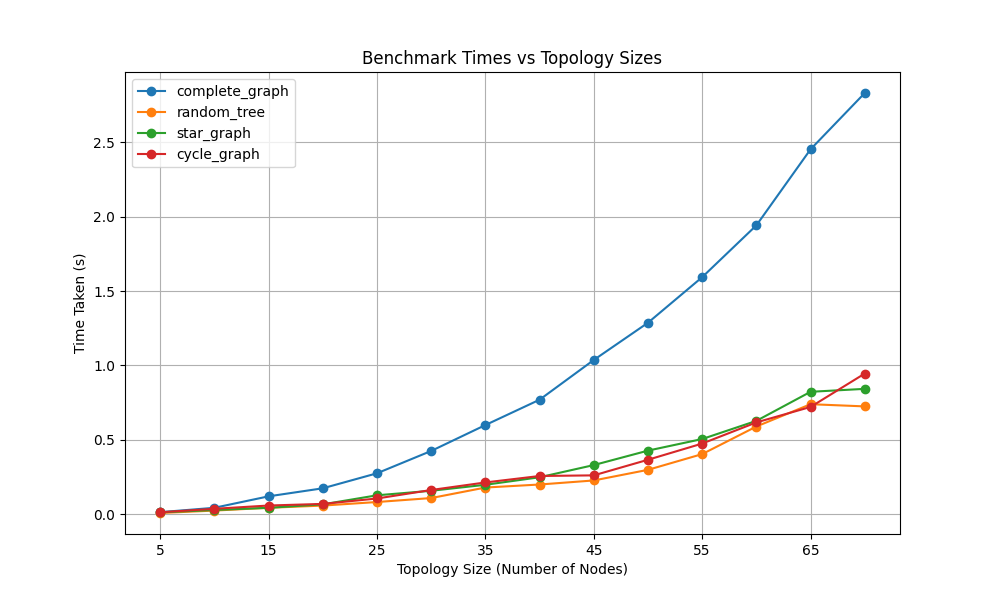

.. include:: substitutions.rst

Implementation, Results and Discussion
======================================

Implementation and Methodology
~~~~~~~~~~~~~~~~~~~~~~~~~~~~~~~~~~~~

We have implemented the Temporally-Ordered Routing Algorithm in Python as is available as an open-source repository on Github. The implementation is based on the algorithm described in the paper in section 1.3 and follows the structure of AHCv2 and utilizes its components (e.g. channels, generic messages, etc.). For the evaluation phase, this algorithm is benchmarked with different topologies structures and sizes. The results along with the discussion are presented in the next section. Additionally you can view the TORA component module in the Python Module Index of this document.

The setup included the usage of Python and a Docker container which is included in the repository of this project.

Results
~~~~~~~~

For the evaluation phase, the implementation was benchmarked with six different topological structures. These ones tested were:

- Complete graph
- Ladder graph
- Wheel graph
- Ring graph,
- Star graph
- Tree  

For each topology, we tested it with different topology sizes ranging from up to 110 nodes. Each run included the generation of a random topology with by using the "networkx" library for Python. Moreover, for each topology, a random source and destination was generated and the routing algorithm was run afterwards. However, to minimize the effect of randomness, the routing algorithm was run 3 times for each topology and the average of the results was taken. 

Although higher number of topology was attempted to be tested, due to the limitation of the testing computer and the multi-threaded nature of AHCv2, the number of nodes couldn't go higher than 110. In addition for a complete graph, the maximum limit that could be tested was 80 nodes. The results are shown in the following figure.

Discussion
~~~~~~~~~~

In the figure, we observe that the routing performance of TORA (Temporally Ordered Routing Algorithm) is comparable for tree, cyclic graph, and star graph topologies. The wheel and complete graph topology take more time than the former three but they are still on par with one another. However, TORA experiences a significant increase in routing time when it comes to the ladder graph topology. This outcome is not surprising, considering that complete graphs have a larger number of edges and nodes compared to other topologies. Consequently, the higher message exchange rate in complete graphs contributes to the longer routing time.

The main takeaway from this evaluation is that TORA is a dynamic routing algorithm that performs well in various topological structures. However, the routing time increases in a linear fashion in the case of complete graph and ladder topology. This might raise some concerns about the scalability of TORA in more complex topologies. Overall the results highlights the importance of considering the network topology when selecting a routing algorithm. TORA is particularly suitable for tree, cyclic, and star graph topologies, where it demonstrates efficient routing performance.

