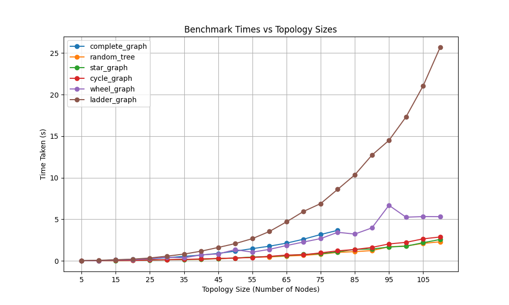

.. include:: substitutions.rst

Implementation, Results and Discussion
======================================

Implementation and Methodology
~~~~~~~~~~~~~~~~~~~~~~~~~~~~~~~~~~~~

We have implemented the Temporally-Ordered Routing Algorithm in Python as is available as an open-source repository on Github. The implementation is based on the algorithm described in the paper in section 1.3 and follows the structure of AHCv2 and utilizes its components (e.g. channels, generic messages, etc.). For the evaluation phase, this algorithm is benchmarked with different topologies structures and sizes. The results along with the discussion are presented in the next section. 

Results
~~~~~~~~

Temporally-Ordered Routing Algorithm (TORA) was benchmarked using four different topology structures: Complete graph, Ring graph, Star graph, and tree. In the experiments, a random topology of the four types mentioned were generated based on the number of nodes we wanted to test. The "networkx" library for Python helped with generating such topologies. The number of nodes in the topologies were varied from 10 to 75. Due to the limitation of the computer that this algorithm was tested on and the multi-threaded nature of AHCv2, the number of nodes was limited to 75. The results are shown in the following figures. For each topology, a random source and destination was generated and the routing algorithm was run afterwards. However, to minimize the effect of randomness, the routing algorithm was run 10 times for each topology and the average of the results was taken. The results are shown in the following figure.

.. .. list-table:: Title
..    :widths: 25 25 50
..    :header-rows: 1

..    * - Heading row 1, column 1
..      - Heading row 1, column 2
..      - Heading row 1, column 3
..    * - Row 1, column 1
..      -
..      - Row 1, column 3
..    * - Row 2, column 1
..      - Row 2, column 2
..      - Row 2, column 3

Discussion
~~~~~~~~~~

From the figure we can see that routing performance with the tree, cyclic graph and star graph are more or less on par with each other. However, for a complete graph, we can see that there is a significant rise to how much time it takes for TORA to complete the routing. This is not entirely shocking as the complete graph has a higher number of edges and nodes compared to the other topologies. This means that the number of messages that are being sent and received is higher in the complete graph compared to the other topologies.

.. [Shuttleworth2016] M. Shuttleworth. (2016) Writing methodology. `Online <https://explorable.com/writing-methodology>`_.